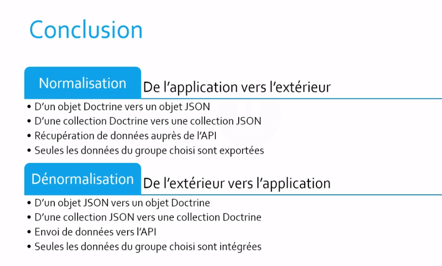
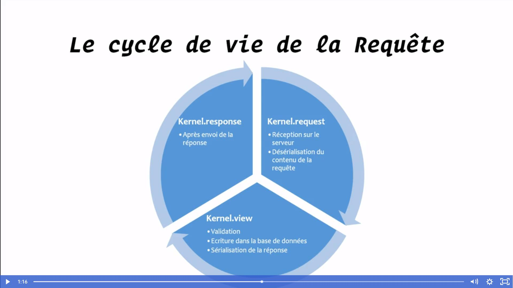

# Installing API Platform Core

```zsh
composer require api
```

Dans toutes mes entités je dois mettre.
Si une entité est liée à une autre, il faut aussi renseigner @ApiResource

```php

/**
 * @ORM\Entity(repositoryClass=UserRepository::class)
 * @ApiResource
 */
class User implements UserInterface
```

Définir perPage pour des entités

```php
/**
 * @ORM\Entity(repositoryClass=InvoiceRepository::class)
 * @ApiResource(
 * attributes={
 *      "pagination_enabled"=true,
 *      "item_per_page"=20
 *  }
 * )
 *
 */
```

## Normalisation et Sérialisation

**Normalisation**

Passage d'objet PHP en Array classique.

**Sérialisation**

    Passage des tableaux php et les transformze dans un autre format ( **eg** Array Json) . Du tableau php on peut *dénormaliser* a des entités doctrines.

## #Deux contextes possibles


De doctrine vers Json et react.

de react , via un formulaire à doctrine



### Normalisation

Il faut tout d'abord créer un group sur class puis spécificier sur chaque variable le groupe en question pour qu'il soit accessible.

```php
/**
 * @ORM\Entity(repositoryClass=InvoiceRepository::class)
 * @ApiResource(
 * normalizationContext={"groups"={"invoices_read"}}
 * )
 *
 * Ordonner la propriété X en ASC ou DESC
 *  exemple: /api/invoices?order[amount]=asc
 * @ApiFilter(OrderFilter::class,properties={"amount","sentAt"})
 *
 */
```

```php
/**
 * @ORM\Column(type="string", length=255)
 * @Groups({"customers_read","invoices_read"})
 */
pri

vate $firstName;
```

## Activer / Désactiver des opérations sur une ressource

Par défaut 5 opérations sont possible

Create
Read ( all and one)
U (update)
D (delete)
Il suffit de définir les options avec

```php
/**
 * @ORM\Entity(repositoryClass=CustomerRepository::class)
 * @ApiResource(collectionOperations={"GET"={"path"="customers"},"POST"})
 */
```

## Une sous ressource : Récupérer les factures d'un client via l'url

Pour chaque ressource il est possible de créer une sous ressource.

# Sécurisation de l'API via des token JWT

```
php composer.phar require "lexik/jwt-authentication-bundle"
```

Generate the SSL keys:

```
 php bin/console lexik:jwt:generate-keypai
```

dans config/routes.yaml

```yaml
api_login_check:
  path: /api/login_check
```

dans security.yaml

```
security:
  encoders:
    App\Entity\User:
      algorithm: auto

  # https://symfony.com/doc/current/security.html#where-do-users-come-from-user-providers
  providers:
    # used to reload user from session & other features (e.g. switch_user)
    app_user_provider:
      entity:
        class: App\Entity\User
        property: email
  firewalls:
    dev:
      pattern: ^/(_(profiler|wdt)|css|images|js)/
      security: false
    login:
      pattern: ^/api/login
      stateless: true
      anonymous: true
      json_login:
        check_path: /api/login_check
        success_handler: lexik_jwt_authentication.handler.authentication_success
        failure_handler: lexik_jwt_authentication.handler.authentication_failure

    api:
      pattern: ^/api
      stateless: true
      guard:
        authenticators:
          - lexik_jwt_authentication.jwt_token_authenticator
    main:
      anonymous: true
      lazy: true
      provider: app_user_provider

      # activate different ways to authenticate
      # https://symfony.com/doc/current/security.html#firewalls-authentication
      # https://symfony.com/doc/current/security/impersonating_user.html
      # switch_user: true

  # Easy way to control access for large sections of your site
  # Note: Only the *first* access control that matches will be used
  access_control:
    # - { path: ^/admin, roles: ROLE_ADMIN }
    # - { path: ^/profile, roles: ROLE_USER }

```

Activer l'enrengistrement des utilisateurs

```
registration:
    stateless: true
    anonymous: true
```

Sécuriser la registration

```yaml
security:
  encoders:
    App\Entity\User:
      algorithm: auto

  # https://symfony.com/doc/current/security.html#where-do-users-come-from-user-providers
  providers:
    # used to reload user from session & other features (e.g. switch_user)
    app_user_provider:
      entity:
        class: App\Entity\User
        property: email
  firewalls:
    dev:
      pattern: ^/(_(profiler|wdt)|css|images|js)/
      security: false

    registration:
      pattern: ^/api/login
      stateless: true
      anonymous: true
      methods: [POST]

    login:
      pattern: ^/api/login
      stateless: true
      anonymous: true
      json_login:
        check_path: /api/login_check
        success_handler: lexik_jwt_authentication.handler.authentication_success
        failure_handler: lexik_jwt_authentication.handler.authentication_failure

    api:
      pattern: ^/api
      stateless: true
      guard:
        authenticators:
          - lexik_jwt_authentication.jwt_token_authenticator
    main:
      anonymous: true
      lazy: true
      provider: app_user_provider

      # activate different ways to authenticate
      # https://symfony.com/doc/current/security.html#firewalls-authentication
      # https://symfony.com/doc/current/security/impersonating_user.html
      # switch_user: true

  # Easy way to control access for large sections of your site
  # Note: Only the *first* access control that matches will be used
  access_control:
    # - { path: ^/admin, roles: ROLE_ADMIN }
    # - { path: ^/profile, roles: ROLE_USER }
```

Configuration finale

```yaml
security:
  encoders:
    App\Entity\User:
      algorithm: auto

  # https://symfony.com/doc/current/security.html#where-do-users-come-from-user-providers
  providers:
    # used to reload user from session & other features (e.g. switch_user)
    app_user_provider:
      entity:
        class: App\Entity\User
        property: email
  firewalls:
    dev:
      pattern: ^/(_(profiler|wdt)|css|images|js)/
      security: false

    registration:
      pattern: ^/api/login
      stateless: true
      anonymous: true
      methods: [POST]

    login:
      pattern: ^/api/login
      stateless: true
      anonymous: true
      json_login:
        check_path: /api/login_check
        success_handler: lexik_jwt_authentication.handler.authentication_success
        failure_handler: lexik_jwt_authentication.handler.authentication_failure

    api:
      pattern: ^/api
      stateless: true
      guard:
        authenticators:
          - lexik_jwt_authentication.jwt_token_authenticator

      # Option a configurer avec access_contro !!! Aucune sécurité n'est active dans le cas contraire
      anonymous: true

    main:
      anonymous: true
      lazy: true
      provider: app_user_provider

      # activate different ways to authenticate
      # https://symfony.com/doc/current/security.html#firewalls-authentication
      # https://symfony.com/doc/current/security/impersonating_user.html
      # switch_user: true

  # Easy way to control access for large sections of your site
  # Note: Only the *first* access control that matches will be used
  access_control:
    - { path: ^/api/login, roles: IS_AUTHENTICATED_ANONYMOUSLY }
    - { path: ^/api/customers, roles: IS_AUTHENTICATED_FULLY }
    - { path: ^/api/invoices, roles: IS_AUTHENTICATED_FULLY }
    - {
        path: ^/api/users,
        roles: IS_AUTHENTICATED_FULLY,
        # POST n'est pas utile une fois connecté, on ne veut laisser la possibiliter de créer un compte si l'on est connecté
        methods: ["GET", PUT, DELETE],
      }
    - { path: ^/api/customers, roles: IS_AUTHENTICATED_FULLY }
    # - { path: ^/admin, roles: ROLE_ADMIN }
    # - { path: ^/admin, roles: ROLE_ADMIN }
    # - { path: ^/profile, roles: ROLE_USER }
```

## ApiPlatform #06 - Intervenir aux moments clés grâce aux événements du Kernel

**3 types d'évenement**


### Intervenir sur la création d'un User pour hasher le mot de passe

Créer un dossier src/Events et le fichier PasswordEncoderSubscriber.php

```php
<?php

namespace App\Events;

use App\Entity\User;
use Symfony\Component\HttpKernel\KernelEvents;
use Symfony\Component\HttpKernel\Event\ViewEvent;
use ApiPlatform\Core\EventListener\EventPriorities;
use Symfony\Component\EventDispatcher\EventSubscriberInterface;
use Symfony\Component\Security\Core\Encoder\UserPasswordEncoderInterface;

/**
 * Permet le chiffrage du mot de passe avant son enrengistrement en BDD
 */
class PasswordEncoderSubscriber implements EventSubscriberInterface
{
    /**
     * @var UserPasswordEncoderInterface
     */
    protected $encoder;

    public function __construct(UserPasswordEncoderInterface $encoder)
    {
        $this->encoder = $encoder;
    }


    /**
     * Retourne une liste des méthodes que l'on peut brancher à des événements .
     */
    public static function getSubscribedEvents()
    {
        /**
         * Liste des méthodes que l'on veut brancher à des évènements.
         * On appelle la fonction encodePassword avant l'évènement
         * d'enrengistrement de la donnée
         *
         */
        return [KernelEvents::VIEW => ['encodePassword', EventPriorities::PRE_WRITE]];
    }

    public function encodePassword(ViewEvent $event)
    {
        /**
         * Récupérer le résultat du controller api platform
         * Dans notre cas il s'agit d'un User
         * @var ViewEvent
         */
        $user = $event->getControllerResult();
        dd($user);

        // Renvoie la méthode utilisée GET POST, PUT ...
        $method = $event->getRequest()->getMethod();

        /**
         * Encoder le password d'un utilisateur si les conditions sont remplies.
         * Récupérer un User via la method POST ( on parle d'une création
         *  d'un utilisateur)
         */
        if ($user instanceof User && $method === "POST") {
            /**
             * Récupérer le mot de passe en claire et le définir encodée
             * @var string
             */
            $encodedPassword = $this->encodePassword($user, $user->getPassword());
            $user->setPassword($encodedPassword);
        }
    }
}

```

## Intervenir sur la création d'un Customer pour le lier à l'utilisateur courant

```php
<?php

namespace App\Events;

use App\Entity\User;
use App\Entity\Customer;
use Symfony\Component\Security\Core\Security;
use Symfony\Component\HttpKernel\KernelEvents;
use Symfony\Component\HttpKernel\Event\ViewEvent;
use ApiPlatform\Core\EventListener\EventPriorities;
use Symfony\Component\EventDispatcher\EventSubscriberInterface;
use Symfony\Component\Security\Core\Authentication\Token\Storage\TokenStorageInterface;

class CustomerUserSubscriber implements EventSubscriberInterface
{
    protected $security;

    public function __construct(Security $security)
    {
        $this->security = $security;
    }

    /**
     * Retourne une liste des méthodes que l'on peut brancher à des événements .
     */
    public static function getSubscribedEvents()
    {
        /**
         * Liste des méthodes que l'on veut brancher à des évènements.
         * On appelle la fonction setUserCustomer avant l'évènement
         * de validation des données
         *
         */
        return [KernelEvents::VIEW => ['setUserForCustomer', EventPriorities::PRE_VALIDATE]];
    }

    public function setUserForCustomer(ViewEvent $event)
    {
        /**
         * Récupérer le résultat du controller
         * Dans notre cas il s'agit dun

         */
        $customer =  $event->getControllerResult();
        $method = $event->getRequest()->getMethod();

        if ($customer instanceof Customer && $method === "POST") {

            /**
             * Récupére l'utilisateur actuel
             */
            $user = $this->security->getUser();

            /**
             * Rattacher notre Customer à l'utilisateur actuellement connecté
             * Condition obligatoire pour passer la validation Symfony
             */
            $customer->setUser($user);
        }
    }
}

```

## Intervenir sur la création d'une Invoice pour lui donner un chrono

```php
<?php

namespace App\Events;

use App\Entity\Invoice;
use App\Repository\InvoiceRepository;
use Symfony\Component\Security\Core\Security;
use Symfony\Component\HttpKernel\KernelEvents;
use Symfony\Component\HttpKernel\Event\ViewEvent;
use ApiPlatform\Core\EventListener\EventPriorities;
use App\Helper\CheckAndSetDate;
use Symfony\Component\EventDispatcher\EventSubscriberInterface;

class InvoiceChronoIncrement implements EventSubscriberInterface
{
    protected $security;
    protected $repository;
    protected $date;

    public function __construct(Security $security, InvoiceRepository $repository, CheckAndSetDate $date)
    {
        $this->repository = $repository;
        $this->security = $security;
        $this->date = $date;
    }
    /**
     * Retourne une liste des méthodes que l'on peut brancher à des événements .
     */
    public static function getSubscribedEvents()
    {
        /**
         * Liste des méthodes que l'on veut brancher à des évènements.
         * On appelle la fonction setUserCustomer avant l'évènement
         * de validation des données
         * Pour passer la validation, l'incrémentation doit être définie.
         */
        return [KernelEvents::VIEW => ['setChronoForInvoice', EventPriorities::PRE_VALIDATE]];
    }

    public function setChronoForInvoice(ViewEvent $event)
    {
        /**
         * Récupérer le résultat du controller
         * Dans notre cas il s'agit d'un Invoice
         * Dans mon invoice je n'ai pas le chrono mais j'ai le customer en question !
         * @var Invoice
         */

        $invoice =  $event->getControllerResult();
        $method = $event->getRequest()->getMethod();

        /**
         * * Si l'on récupère une instance Invoice en Post alors
         * * Récupérer l'utilisateur
         * * Récupérer le chrono de la dernière facture du customer en cours
         *  ( il est renseigné dans l'instance invoice)
         * * Définir le chrono
         */
        if ($invoice instanceof Invoice && $method === "POST") {

            $user = $this->security->getUser();

            $nextChrono = $this->repository->findNextChrono($user);
            $invoice->setChrono($nextChrono);
            $this->date->checkAndSet($invoice);
        }
    }
}

```

## Intervenir sur la création du JWT pour enrichir ses données

Customiser ce qui est encodée dans le JWT

Décodée , le JWT nous renvoie un Json avec certaines infos

```json
{
  "iat": 1614344711,
  "exp": 1614348311,
  "roles": ["ROLE_USER"],
  "username": "lucas.michele@guilbert.fr"
}
```

Ce n'est pas un évènement à proprement parlé comme InvoiceChronoIncrement. Il faut le configurer commme un service

```yaml
# This file is the entry point to configure your own services.
# Files in the packages/ subdirectory configure your dependencies.

# Put parameters here that don't need to change on each machine where the app is deployed
# https://symfony.com/doc/current/best_practices/configuration.html#application-related-configuration
parameters:

services:
  # default configuration for services in *this* file
  _defaults:
    autowire: true # Automatically injects dependencies in your services.
    autoconfigure: true # Automatically registers your services as commands, event subscribers, etc.

  # makes classes in src/ available to be used as services
  # this creates a service per class whose id is the fully-qualified class name
  App\:
    resource: "../src/"
    exclude:
      - "../src/DependencyInjection/"
      - "../src/Entity/"
      - "../src/Kernel.php"
      - "../src/Tests/"

  # controllers are imported separately to make sure services can be injected
  # as action arguments even if you don't extend any base controller class
  App\Controller\:
    resource: "../src/Controller/"
    tags: ["controller.service_arguments"]

  App\Events\JwtCreatedSubscriber:
    tags:
      - {
          name: kernel.event_listener,
          event: lexik_jwt_authentication.on_jwt_created,
          method: updateJwtData,
        }
  # add more service definitions when explicit configuration is needed
  # please note that last definitions always *replace* previous ones
```

```php
<?php

namespace App\Events;

use App\Entity\User;
use Lexik\Bundle\JWTAuthenticationBundle\Event\JWTCreatedEvent;

class JwtCreatedSubscriber
{
    /**
     * La fonction est appellé automatiquement lors d'un évènement de création de token
     * pour nous permettre sa modification ou non
     */
    public function updateJwtData(JWTCreatedEvent $event)
    {
        /**
         * $event->getData()
         *
         * Il est possible de travailler sur les datas d'un événement
         * Dans ce cas on récupère le PAYLOAD, c'est à dire les données
         * qui sont dans le token. Ces données sont modifiables.
         *
         * On a donc un utilisateur mais on veut renseigner plus de valeur.
         * Par défaut on a un tableau avec le ROLE et userName en clée / valeur.
         * On voudrait rajouter dans le tableau firstName et lastName
         *
         * Note : La clef est définit par le dev tandis que la valeur est obtenue
         *        via les méthodes de la Class User ( dans notre cas )
         */

        /**
         * @var User
         */
        $user = $event->getUser();

        $data = $event->getData();

        $data['firstName'] = $user->getFirstName();
        $data['lastName'] = $user->getLastName();

        $event->setData($data);
    }
}

```

## Extensions de Doctrine : modifier les requêtes DQL d'ApiPlatform

A la création des entités, on a crée des events pour les modifier et intégrer
les informations manquantes ( l'utilisateur, la date ... )

Lorsqu'il s'agit d'afficher les facture. l'API renvoie toutes les factures ! Pas seulement ceux de l'utilisateur connecté !

Il faudra modifier la modifier la requête en cours pour prendre en compte l'utiliseur connecté.

```php
<?php
// src/Doctrine/CurrentUserExtension.php
namespace App\Doctrine;

use App\Entity\Customer;
use Doctrine\ORM\QueryBuilder;
use Symfony\Component\Security\Core\Security;
use ApiPlatform\Core\Bridge\Doctrine\Orm\Util\QueryNameGeneratorInterface;
use ApiPlatform\Core\Bridge\Doctrine\Orm\Extension\QueryItemExtensionInterface;
use ApiPlatform\Core\Bridge\Doctrine\Orm\Extension\QueryCollectionExtensionInterface;
use App\Entity\Invoice;

class CurrentUserExtension implements QueryCollectionExtensionInterface, QueryItemExtensionInterface
{
    protected $security;

    public function __construct(Security $security)
    {
        $this->security = $security;
    }


    /**
     * Doctrine peut effectuer des requêtes pou récupérer des collections
     * Il se rend compte que l'on a une extension et appliquer des coorectifs | ameiliorations
     *
     * @param QueryBuilder $queryBuilder il s'agit de la requête Doctrine
     * @param QueryNameGeneratorInterface $queryNameGenerator
     * @param string $resourceClass Le nom de la class sur laquelle on est entrain de faire des requêtes ( ex : la liste des invoices -> la class Invoice)
     * @param string|null $operationName
     * @return void
     */
    public function applyToCollection(QueryBuilder $queryBuilder, QueryNameGeneratorInterface $queryNameGenerator, string $resourceClass, ?string $operationName = null)
    {
        // Obtenir l'utilisateur connecté
        $user =  $this->security->getUser();

        /**
         * Si l'on demande des invoices ou des customers alors agir sur la requête
         * pour qu'elle tienne compte de l'utilisateur
         */
        // $rootAlias = $queryBuilder->

        if ($resourceClass === Customer::class || $resourceClass === Invoice::class) {
}
    }


    /**
     *
     * @param QueryBuilder $queryBuilder
     * @param QueryNameGeneratorInterface $queryNameGenerator
     * @param string $resourceClass
     * @param array $identifiers
     * @param string|null $operationName
     * @param array $context
     * @return void
     */
    public function applyToItem(QueryBuilder $queryBuilder, QueryNameGeneratorInterface $queryNameGenerator, string $resourceClass, array $identifiers, ?string $operationName = null, array $context = [])
    {
    }
}

```

## Extension de Doctrine : ajout du cas d'utilisateurs non connectés

Je veux que les Customers soient accessibles aux gens qui ne sont pas connectés.

Dans security.yaml nous avons

```yaml
access_control:
  - { path: ^/api/customers, roles: IS_AUTHENTICATED_ANONYMOUSLY }
```

et dans CurrentUserExtension.php

```php
if (
            // Checker qu'on a la bonne ressource
            ($resourceClass === Customer::class || $resourceClass === Invoice::class)
            // Que l'utilisateur *à un Rôle Admin
            && !$this->auth->isGranted('ROLE_ADMIN')
            // Qu'il est connecté ( si pas connecté $user renvoie null )
            && $user instanceof User
    ) {
        // Le reste du code ici
      }
```

## Création de la page d'accueil de notre site qui portera l'application React

Il faut créer un controller AppController et définir la route en /

Pour que le refresh automatique de webpack puisse fonctionner il faut modifier le port de dev-server dans package.json en 8080

```json
{
  "devDependencies": {
    "@symfony/stimulus-bridge": "^2.0.0",
    "@symfony/webpack-encore": "^1.0.0",
    "core-js": "^3.0.0",
    "regenerator-runtime": "^0.13.2",
    "sass": "^1.32.8",
    "sass-loader": "^11.0.0",
    "stimulus": "^2.0.0",
    "webpack-notifier": "^1.6.0"
  },
  "license": "UNLICENSED",
  "private": true,
  "scripts": {
    "dev-server": "encore dev-server --port 8080",
    "dev": "encore dev",
    "watch": "encore dev --watch",
    "build": "encore production --progress"
  }
}
```

En fonction de notre configuration il faudra accéder au projet via localhost:8000 ou 127.0.0.1:8000

## Installation de React et des dépendances

```
    yarn add @babel/preset-react@^7.0.0 --dev
```

r
Activer react dans webpack.config.js

```js
  .enableReactPreset();
```

et dans app.js

```js
/*
 * Welcome to your app's main JavaScript file!
 *
 * We recommend including the built version of this JavaScript file
 * (and its CSS file) in your base layout (base.html.twig).
 */

//  Import React

import React from "react";
import ReactDom from "react-dom";

// any CSS you import will output into a single css file (app.css in this case)
import "./styles/app.scss";

// start the Stimulus application
import "./bootstrap";
console.log("Wesh ma gueule");

// Module <App />
const App = () => {
  return <h1>Bonjour à tous </h1>;
};

// Définir notre root Element
const rootElement = document.querySelector("#app");

// Demander à react de générer le composant < APP /> dans rootElement

ReactDom.render(<App />, rootElement);
```

## Création de la page d'accueil et de la barre de navigation

créer NavBar.jsx

class="" devient className et input, hr doit être fermé ! ( à l'inverse de html5) <input></input>

```jsx
/*
 * Welcome to your app's main JavaScript file!
 *
 * We recommend including the built version of this JavaScript file
 * (and its CSS file) in your base layout (base.html.twig).
 */

//  Import React

import React from "react";
import ReactDom from "react-dom";

// any CSS you import will output into a single css file (app.css in this case)
import "../styles/app.scss";

// start the Stimulus application
import "../bootstrap";
import Navbar from "./components/NavBar";
import HomePage from "./pages/HomePage";

// Module <App />
const App = () => {
  return (
    <>
      <Navbar />
      <div className="container pt-5">
        <HomePage />
      </div>
    </>
  );
};

// Définir notre root Element
const rootElement = document.querySelector("#app");

// Demander à react de générer le composant < APP /> dans rootElement

ReactDom.render(<App />, rootElement);
```

## Mise en place du routage avec React Router Dom

Il faut importer certaines choses

HashRouter permet de faire des routes qui commencent par # eg : #/customers

Switch permet d'afficher le bon composant en fonction de la route

Le composant Route permet de faire la correspondance entre une URL ( route ) et un composant / affichage

```jsx
/*
 * Welcome to your app's main JavaScript file!
 *
 * We recommend including the built version of this JavaScript file
 * (and its CSS file) in your base layout (base.html.twig).
 */

//  Import React

import React from "react";
import ReactDom from "react-dom";
import { HashRouter, Switch, Route } from "react-router-dom";

// any CSS you import will output into a single css file (app.css in this case)
import "../styles/app.scss";

// start the Stimulus application
import "../bootstrap";
import Navbar from "./components/NavBar";
import HomePage from "./pages/HomePage";
import CustomersPage from "./pages/CustomersPage";

// Module <App />
const App = () => {
  return (
    <HashRouter>
      <Navbar />
      <main className="container pt-5">
        <Switch>
          <Route path="/customers" component={CustomersPage} />
          <Route path="/" component={HomePage} />
        </Switch>
      </main>
    </HashRouter>
  );
};

// Définir notre root Element
const rootElement = document.querySelector("#app");

// Demander à react de générer le composant < APP /> dans rootElement

ReactDom.render(<App />, rootElement);
```

A noter que la route la plus précise doit être précisée en premier !

## Création de la page de liste des Customers

```jsx
import React from "react";
const CustomersPage = (props) => {
  return (
    <>
      <h1>Liste des clients</h1>
      <table className="table table-hover">
        <thead>
          <tr>
            <th>ID</th>
            <th>Client</th>
            <th>Email</th>
            <th>Entreprise</th>
            <th className="text-center">Factures</th>
            <th className="text-center">Montant total</th>
            <th></th>
          </tr>
        </thead>
        <tbody>
          <tr>
            <td>18</td>
            <td>
              <a href="">David Vanmak</a>
            </td>
            <td>vanmakdavid@gmail.com</td>
            <td>Apollo-Immo</td>
            <td className="text-center">
              <span className="badge badge-primary ">4</span>
            </td>
            <td className="text-center">2 400,00 €</td>
            <td>
              <button className="btn btn-sm btn-danger">Supprimer</button>
            </td>
          </tr>
        </tbody>
      </table>
    </>
  );
};

export default CustomersPage;
```

## Appel HTTP vers notre API pour récupérer les Customers

Quand on charge le composant CustomerPage.jsx ( la page des Customers) on veut qu'il se passe un effet
On va utiliser le Hook useEffect()

```jsx
import React, { useEffect, useState } from "react";
// Permet de faire des requêtes http
import axios from "axios";

const CustomersPage = (props) => {
  /**
   * Le state se définit par customers avec sa méthode
   * setCustomer qui permet de modifier la variable customers
   */
  const [customers, setCustomers] = useState([]);

  /**
   * Créatioin de l'effet, le deuxième paramètre [] contient la variable à surveiller
   * pour lancer une effect à chaque fois qu'une variable change.
   * On ne surveille pas de variable . On donne une variable vide.
   * La fonction se lancera qu'une seule fois juste quand le composant va s'afficher
   */

  useEffect(() => {
    axios
      .get("https://localhost:8000/api/customers")
      .then((response) => response.data["hydra:member"])

      // Une fois que l'on récupère le tableau data ,
      // changer ce qu'il y a  dans le state customer ave ce que ce l'on récupère ,

      .then((data) => setCustomers(data))
      // Récupération de l'erreur si elle existe
      .catch((error) => console.log(error.response));
  }, []);

  return (
    <>
      <h1>Liste des clients</h1>
      <table className="table table-hover">
        <thead>
          <tr>
            <th>ID</th>
            <th>Client</th>
            <th>Email</th>
            <th>Entreprise</th>
            <th className="text-center">Factures</th>
            <th className="text-center">Montant total</th>
            <th></th>
          </tr>
        </thead>
        <tbody>
          {customers.map((customer) => (
            <tr key={customer.id}>
              <td>{customer.id}</td>
              <td>
                <a href="#">
                  {customer.firstName} {customer.lastName}
                </a>
              </td>
              <td>{customer.email}</td>
              <td>{customer.compagny}</td>
              <td className="text-center">
                {customer.totalAmount.toLocaleString()} €
              </td>
              <td>
                <button className="btn btn-sm btn-danger">Supprimer</button>
              </td>
            </tr>
          ))}
        </tbody>
      </table>
    </>
  );
};

export default CustomersPage;
```

## Permettre la suppression d'un Customer

```jsx
import React, { useEffect, useState } from "react";
// Permet de faire des requêtes http
import axios from "axios";

const CustomersPage = (props) => {
  /**
   * Le state se définit par customers avec sa méthode
   * setCustomer qui permet de modifier la variable customers
   */
  const [customers, setCustomers] = useState([]);

  /**
   * Créatioin de l'effet, le deuxième paramètre [] contient la variable à surveiller
   * pour lancer une effect à chaque fois qu'une variable change.
   * On ne surveille pas de variable . On donne une variable vide.
   * La fonction se lancera qu'une seule fois juste quand le composant va s'afficher
   */

  useEffect(() => {
    axios
      .get("https://localhost:8000/api/customers")
      .then((response) => response.data["hydra:member"])

      // Une fois que l'on récupère le tableau data ,
      // changer ce qu'il y a  dans le state customer ave ce que ce l'on récupère ,

      .then((data) => setCustomers(data))
      // Récupération de l'erreur si elle existe
      .catch((error) => console.log(error.response));
  }, []);

  const handleDelete = (id) => {
    // lancer une requête pour supprimer le Customer
    axios
      .delete(`https://localhost:8000/api/customers/${id}`)
      // Quand ça sera fait , on reçoit une réponse
      .then((response) => console.log(response));
  };
  return (
    <>
      <h1>Liste des clients</h1>
      <table className="table table-hover">
        <thead>
          <tr>
            <th>ID</th>
            <th>Client</th>
            <th>Email</th>
            <th>Entreprise</th>
            <th className="text-center">Factures</th>
            <th className="text-center">Montant total</th>
            <th></th>
          </tr>
        </thead>
        <tbody>
          {customers.map((customer) => (
            <tr key={customer.id}>
              <td>{customer.id}</td>
              <td>
                <a href="#">
                  {customer.firstName} {customer.lastName}
                </a>
              </td>
              <td>{customer.email}</td>
              <td>{customer.compagny}</td>
              <td className="text-center">
                {customer.totalAmount.toLocaleString()} €
              </td>
              <td>
                <button
                  // Si on clique sur le bouton, lancer la function fléchée handleDelete avec comme param customer.id
                  onClick={() => {
                    handleDelete(customer.id);
                  }}
                  // Désactiver le bouton si l'on a des factures ( on ne veut pas d'orphelin )
                  disabled={customer.invoices.length > 0}
                  className="btn btn-sm btn-danger"
                >
                  Supprimer
                </button>
              </td>
            </tr>
          ))}
        </tbody>
      </table>
    </>
  );
};

export default CustomersPage;
```

## Raffraichir La page lorsque l'on supprime des Customers

```jsx
import React, { useEffect, useState } from "react";
// Permet de faire des requêtes http
import axios from "axios";

const CustomersPage = (props) => {
  /**
   * Le state se définit par customers avec sa méthode
   * setCustomer qui permet de modifier la variable customers
   */
  const [customers, setCustomers] = useState([]);

  /**
   * Créatioin de l'effet, le deuxième paramètre [] contient la variable à surveiller
   * pour lancer une effect à chaque fois qu'une variable change.
   * On ne surveille pas de variable . On donne une variable vide.
   * La fonction se lancera qu'une seule fois juste quand le composant va s'afficher
   */

  useEffect(() => {
    axios
      .get("https://localhost:8000/api/customers")
      .then((response) => response.data["hydra:member"])

      // Une fois que l'on récupère le tableau data ,
      // changer ce qu'il y a  dans le state customer ave ce que ce l'on récupère ,

      .then((data) => setCustomers(data))
      // Récupération de l'erreur si elle existe
      .catch((error) => console.log(error.response));
  }, []);

  const handleDelete = (id) => {
    // Copie du tableau des customers
    const originalCustomers = [...customers];

    // Supprimer visuellement
    setCustomers(customers.filter((customer) => customer.id !== id));

    axios
      .delete(`https://localhost:8000/api/customers/${id}`)
      // Lorsque la suppression est faite alors supprimer de
      .then((response) => console.log("ok"))
      .catch((error) => {
        // Remettre la liste des customers avant suppression si celle ci a échouée
        setCustomers(originalCustomers);
        console.log(error.response);
      });
  };
  return (
    <>
      <h1>Liste des clients</h1>
      <table className="table table-hover">
        <thead>
          <tr>
            <th>ID</th>
            <th>Client</th>
            <th>Email</th>
            <th>Entreprise</th>
            <th className="text-center">Factures</th>
            <th className="text-center">Montant total</th>
            <th></th>
          </tr>
        </thead>
        <tbody>
          {customers.map((customer) => (
            <tr key={customer.id}>
              <td>{customer.id}</td>
              <td>
                <a href="#">
                  {customer.firstName} {customer.lastName}
                </a>
              </td>
              <td>{customer.email}</td>
              <td>{customer.compagny}</td>
              <td className="text-center">
                {customer.totalAmount.toLocaleString()} €
              </td>
              <td>
                <button
                  // Si on clique sur le bouton, lancer la function fléchée handleDelete avec comme param customer.id
                  onClick={() => {
                    handleDelete(customer.id);
                  }}
                  // Désactiver le bouton si l'on a des factures ( on ne veut pas d'orphelin )
                  disabled={customer.invoices.length > 0}
                  className="btn btn-sm btn-danger"
                >
                  Supprimer
                </button>
              </td>
            </tr>
          ))}
        </tbody>
      </table>
    </>
  );
};

export default CustomersPage;
```

## Mise en place d'une pagination sur la liste des Customers

```jsx
import React, { useEffect, useState } from "react";
// Permet de faire des requêtes http
import axios from "axios";

const CustomersPage = (props) => {
  /**
   * Le state se définit par customers avec sa méthode
   * setCustomer qui permet de modifier la variable customers
   */
  const [customers, setCustomers] = useState([]);

  // currentPage est un stage dont la page par défaut est définit à 1
  const [currentPage, setCurrentPage] = useState(1);

  /**
   * Créatioin de l'effet, le deuxième paramètre [] contient la variable à surveiller
   * pour lancer une effect à chaque fois qu'une variable change.
   * On ne surveille pas de variable . On donne une variable vide.
   * La fonction se lancera qu'une seule fois juste quand le composant va s'afficher
   */

  useEffect(() => {
    axios
      .get("https://localhost:8000/api/customers")
      .then((response) => response.data["hydra:member"])

      // Une fois que l'on récupère le tableau data ,
      // changer ce qu'il y a  dans le state customer ave ce que ce l'on récupère ,

      .then((data) => setCustomers(data))
      // Récupération de l'erreur si elle existe
      .catch((error) => console.log(error.response));
  }, []);

  const handleDelete = (id) => {
    // Copie du tableau des customers
    const originalCustomers = [...customers];

    // Supprimer visuellement
    setCustomers(customers.filter((customer) => customer.id !== id));

    axios
      .delete(`https://localhost:8000/api/customers/${id}`)
      // Lorsque la suppression est faite alors supprimer de
      .then((response) => console.log("ok"))
      .catch((error) => {
        // Remettre la liste des customers avant suppression si celle ci a échouée
        setCustomers(originalCustomers);
        console.log(error.response);
      });
  };

  const handleCangePage = (page) => {
    setCurrentPage(page);
  };
  // Pagination
  const itemsPerPage = 10;

  // Arrondir à l'entier supérieur
  const pageCount = Math.ceil(customers.length / itemsPerPage);

  // Tableau pour la boucle for avec map ( des nombre de pages de la pagination)
  const pages = [];
  console.log(pages);

  for (let index = 1; index < pageCount; index++) {
    pages.push(index);
  }

  // D'ou on part(start ) et combien ( itemsPerPage )
  const start = currentPage * itemsPerPage - itemsPerPage;

  const paginatedCustomers = customers.slice(start, start + itemsPerPage);
  return (
    <>
      <h1>Liste des clients</h1>
      <table className="table table-hover">
        <thead>
          <tr>
            <th>ID</th>
            <th>Client</th>
            <th>Email</th>
            <th>Entreprise</th>
            <th className="text-center">Factures</th>
            <th className="text-center">Montant total</th>
            <th></th>
          </tr>
        </thead>
        <tbody>
          {paginatedCustomers.map((customer) => (
            <tr key={customer.id}>
              <td>{customer.id}</td>
              <td>
                <a href="#">
                  {customer.firstName} {customer.lastName}
                </a>
              </td>
              <td>{customer.email}</td>
              <td>{customer.compagny}</td>
              <td className="text-center">
                {customer.totalAmount.toLocaleString()} €
              </td>
              <td>
                <button
                  // Si on clique sur le bouton, lancer la function fléchée handleDelete avec comme param customer.id
                  onClick={() => {
                    handleDelete(customer.id);
                  }}
                  // Désactiver le bouton si l'on a des factures ( on ne veut pas d'orphelin )
                  disabled={customer.invoices.length > 0}
                  className="btn btn-sm btn-danger"
                >
                  Supprimer
                </button>
              </td>
            </tr>
          ))}
        </tbody>
      </table>
      <div>
        <ul className="pagination pagination-sm">
          <li className={`page-item ${currentPage === 1 && "disabled"}`}>
            <button
              className="page-link"
              onClick={() => {
                handleCangePage(currentPage - 1);
              }}
            >
              &laquo;
            </button>
          </li>
          {pages.map((page) => (
            <li
              key={page}
              // Renvoyer la valeur après le && si la condition est vraie
              className={`page-item  ` + (currentPage === page && "active")}
            >
              <button
                className="page-link"
                onClick={() => {
                  handleCangePage(page);
                }}
              >
                {page}
              </button>
            </li>
          ))}
          <li
            className={`page-item ${currentPage === pageCount && "disabled"}`}
          >
            <button
              className="page-link"
              onClick={() => {
                handleCangePage(currentPage + 1);
              }}
            >
              &raquo;
            </button>
          </li>
        </ul>
      </div>
    </>
  );
};

export default CustomersPage;
```

### Refactorisation dans un composant de Pagination

Dans une pagination on a besoin de currentPage, itemPerPage etla longueur pour calculer pageCount et pages

On utilise aussi très souvent handlePageChange, on peut donc le passer en paramètre

```jsx
<Pagination
  currentPage={currentPage}
  itemsPerPage={itemsPerPage}
  length={customers.length}
/>
```
